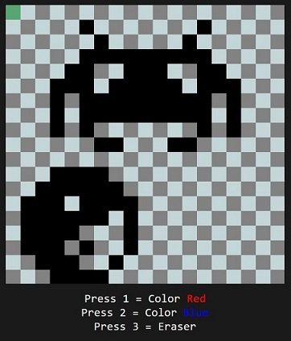

# TS-Paint

Small paint-like program written in typescript, with the goal of 
learning/understanding canvas API a little better.



## Build/Compile

You just need to open `index.html` in your browser of choice.

## Notes

In case you want to play around with the code, the only thing you need is 
globally installed typescript's compiler.

You can run: 
```console
> tsc -w
```
in project's main directory.

You can then change `main.ts` however you like, the compiler will update the corresponding `main.js` file
after every change/save.